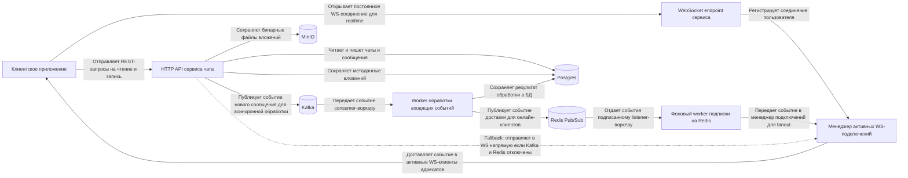
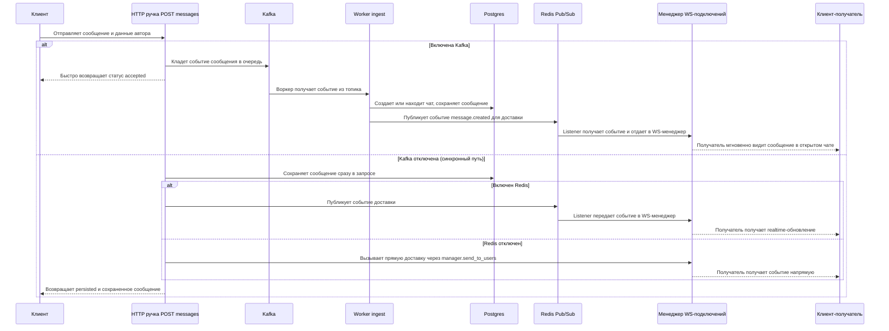
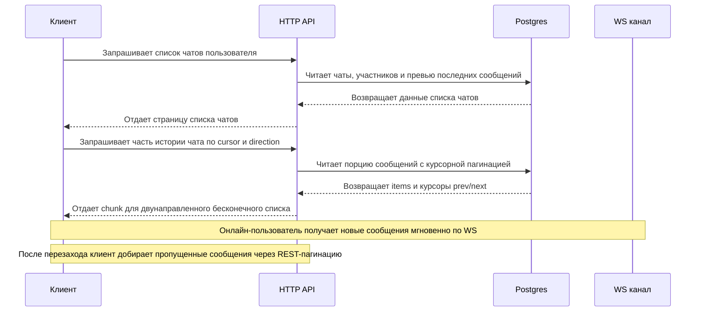
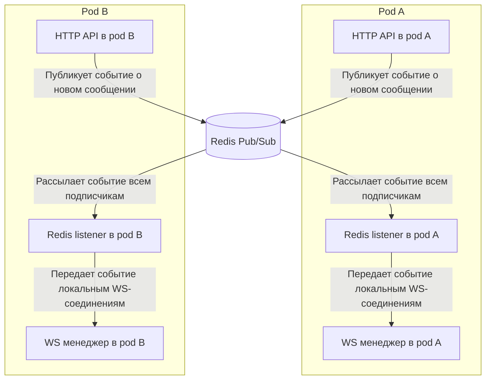

# Chat MVP System Design

## Контекст
- Сервис чата изолирован как blackbox.
- REST слой и WebSocket слой разделены по entrypoints:
  - `src/entrypoints/http` — REST API.
  - `src/entrypoints/websockets` — realtime stream (`/ws`).
- Синхронизация realtime между pod-ами идет через Redis Pub/Sub.
- Асинхронный ingest путь для масштабирования записи идет через Kafka + отдельный worker.
- Хранение данных: Postgres (ORM + миграции).

## Компоненты и связи

## Поток отправки сообщения

## Поток синхронизации и чтения

## Синхронизация между pod-ами

## Гео и масштабирование
- Горизонтальное масштабирование: любой pod может принять REST/WS подключение.
- Realtime fanout: через Redis Pub/Sub события доходят до WS manager каждого pod-а.
- Geo-scope хранится в доменных сущностях сообщений/чатов и может использоваться для geo-routing.
- Kafka ingress decouples API latency от тяжелого пути записи под нагрузкой.

## Инварианты и границы
- Авторизация в MVP: `x-user-id` из токена/шлюза (само auth не реализуется в сервисе).
- Дедупликация может быть расширена через idempotency token (в MVP упрощена).
- ORM-модели используются внутри приложения; сериализация только на уровне `schemas`.
- `bootstrap` не содержит бизнес-логики: только composition root и lifecycle.
