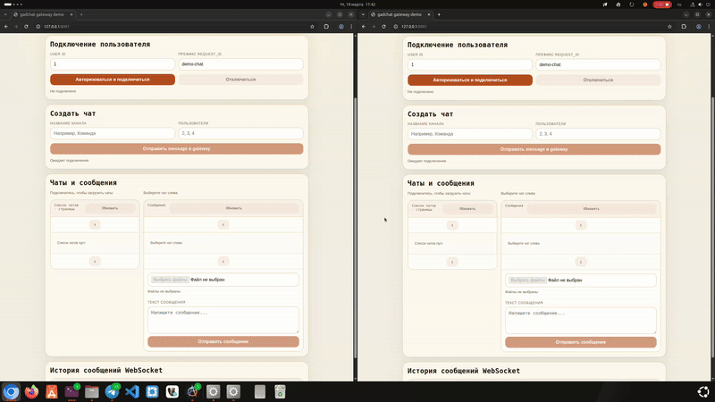
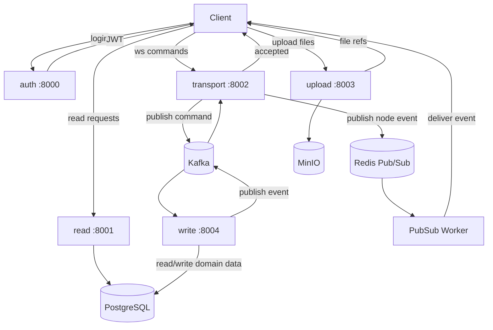
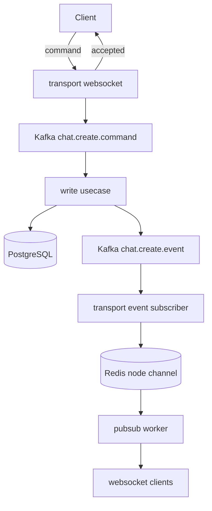

# gadchat

Чат с раздельными сервисами для аутентификации, чтения данных, realtime transport, upload и write-side обработки команд. Система принимает команды через `WebSocket`, исполняет их асинхронно через `Kafka`, хранит доменные данные в `PostgreSQL`, доставляет события через `Redis Pub/Sub` и websocket-соединения, а бинарные файлы сохраняет в `MinIO`.

> Код сгенерирован через ИИ.
> 


Чат: `http://localhost:8001/`

## Сервисы

| Сервис | Порт | Описание | Интерфейсы | Документация |
| --- | --- | --- | --- | --- |
| `auth` | `8000` | Сервис аутентификации. Выдает JWT и возвращает текущего пользователя. | `HTTP` | `Swagger: http://localhost:8000/api/swagger` |
| `read` | `8001` | Read-side сервис. Возвращает список чатов, список сообщений и demo UI. | `HTTP` | `Swagger: http://localhost:8001/api/swagger` |
| `transport` | `8002` | Realtime transport сервис. Принимает websocket-команды, отдает `accepted`, получает события из `Kafka`, публикует node events в `Redis` и содержит фонового delivery worker для рассылки по локальным сокетам. | `HTTP`, `WS`, `Kafka`, `Background Workers` | `Swagger: http://localhost:8002/api/swagger`, `AsyncAPI: http://localhost:8002/asyncapi` |
| `upload` | `8003` | Upload transport сервис. Принимает бинарные файлы, загружает их в `MinIO` и возвращает transport file refs. | `HTTP` | `Swagger: http://localhost:8003/api/swagger` |
| `write` | `8004` | Write-side сервис. Получает команды из `Kafka`, исполняет usecase, пишет данные в `PostgreSQL` и публикует completed/error events. | `HTTP`, `Kafka` | `Swagger: http://localhost:8004/api/swagger`, `AsyncAPI: http://localhost:8004/asyncapi` |

## Инфраструктура

| Компонент | Описание | Интерфейс | GUI |
| --- | --- | --- | --- |
| `PostgreSQL` | Основное хранилище доменных и read-side данных. | SQL | `-` |
| `Redis` | Хранение presence и доставка node-local событий через `Pub/Sub`. | Redis protocol, Pub/Sub | `http://127.0.0.1:8081/` |
| `Kafka` | Шина команд и событий между `transport` и `write`. | Kafka protocol | `http://127.0.0.1:8082/` |
| `MinIO` | Объектное хранилище бинарных файлов. | S3-compatible API | `http://localhost:9001/` |

## Архитектура



## Поток `chat.create`



Порядок обработки:
1. Клиент отправляет `chat.create` в `transport` по `WebSocket`.
2. `transport` возвращает `accepted`.
3. `transport` публикует `chat.create.command` в `Kafka`.
4. `write` получает команду, исполняет usecase и пишет данные в `PostgreSQL`.
5. `write` публикует `chat.create.event` в `Kafka`.
6. `transport` получает событие, определяет target users и node ids.
7. `transport` публикует сообщение в Redis channel нужной ноды.
8. Локальный pubsub worker доставляет событие в websocket-сессии пользователей.

## Запуск

### Окружение

```bash
cp .env.example .env
```

### Установка зависимостей

```bash
pip install -r requirements.txt
```

Зависимости также описаны в `pyproject.toml` для работы через `uv`.

### Миграции

```bash
alembic upgrade head
```

### Загрузка словарей и ролей

```bash
python .scripts/databases/run.py
```

### Запуск сервисов

```bash
python -m src.bootstrap.auth
python -m src.bootstrap.read
python -m src.bootstrap.transport
python -m src.bootstrap.upload
python -m src.bootstrap.write
```

## Таблицы PostgreSQL

| Таблица | Назначение |
| --- | --- |
| `user` | Пользователи системы. |
| `role` | Роли участников чата. |
| `chat` | Чаты. |
| `member` | Участники чатов. |
| `message` | Сообщения чатов. |
| `file` | Metadata файлов. |
| `attachment` | Связь между сообщением и файлом. |
| `reply` | Связь сообщения с reply source message. |
| `forward` | Связь сообщения с forward source message. |
| `read` | Фиксация прочтения сообщения участником. |


## Расширение и масштабирование

Текущая архитектура допускает:
- горизонтальное масштабирование `transport` нод за балансировщиком
- использование общего `Redis` для presence и pubsub delivery
- масштабирование `write` как группы Kafka consumers
- независимое масштабирование `upload`
- добавление новых flows через новые `<topic>.command` и `<topic>.event`
- развитие read-side без изменения transport/write pipeline
