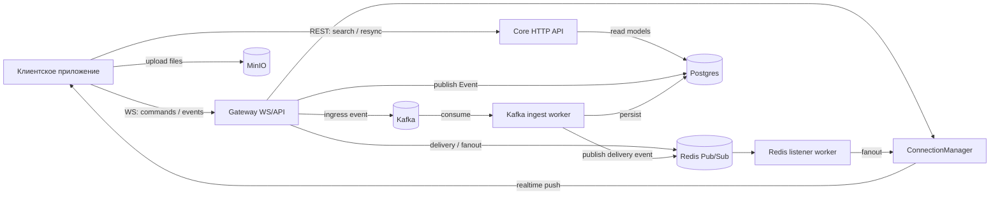

# gadchat

`gadchat` — изолированный backend-сервис чата на `FastAPI` с `WebSocket`-доставкой, рассчитанный на интеграцию в разные продукты как blackbox-компонент.

## Актуальная модель сервисов
- `gateway` — websocket gateway, intake команд, realtime delivery и protocol HTTP docs для websocket topics.
- `core` — REST query/snapshot API для клиента, resync и внутренних чтений.
- `auth` — выдача JWT и auth-related API.
- `uploader` — загрузка бинарных файлов.

Правило разделения транспорта:
- `REST` используется для snapshot, search, pagination и resync.
- `WebSocket` используется для command topics, task ack/status и realtime delta events.
- Gateway protocol HTTP docs используют topic-style paths, например `POST /chat.create.command`.

## Какую задачу решает
- Отправка и хранение сообщений в чатах (включая вложения).
- Realtime-доставка сообщений онлайн-пользователям.
- Пагинация длинной истории чата (cursor-based).
- Горизонтальное масштабирование через shared event-слой (`Redis Pub/Sub`).
- Асинхронный ingest-пайплайн под нагрузку (`Kafka` + отдельный worker).

## Технологии
- `FastAPI` + `uvicorn[standard]`
- `PostgreSQL` + `SQLAlchemy` + `Alembic`
- `Redis` (pub/sub + cache APIs)
- `Kafka` (`faststream` + `aiokafka`) для ingress-потока
- `MinIO` для media-файлов

## Архитектура
- `src/bootstrap`
  - `gateway.py` — websocket gateway процесс
  - `core.py` — REST query API процесс
  - `dispatcher.py` — outbox/operations dispatcher
  - `processer.py` — async processor / broker consumer
  - `auth.py` — auth API процесс
  - `uploader.py` — file upload API процесс
- `src/entrypoints/servers`
  - `gateway` — WS + protocol docs + delivery workers
  - `core` — REST query API
  - `auth` — auth API
  - `uploader` — upload API
- `src/application` — usecases и доменные utils
- `src/infrastructure` — БД, брокеры, storage-клиенты, CRUD/ORM



## Основные API
- `auth`:
  - `POST /users:auth`
- `core`:
  - `POST /chats:search`
  - `POST /chats/{chat_id}/messages:search`
- `gateway`:
  - `WS /ws?token=...`
  - protocol docs:
    - `POST /chat.create.command`
    - `POST /chat.position.command`
    - `POST /message.create.command`
    - `POST /message.pinned.command`
    - `POST /message.read.command`
    - `POST /message.unpinned.command`
- `uploader`:
  - `POST /api/files:image`
  - `POST /api/files:video`
  - `POST /api/files:audio`
  - `POST /api/files:document`

`POST /users:auth` ожидает `x-user-id` в header и возвращает application JWT.
Все защищенные read / realtime ручки ожидают `Authorization: Bearer <token>`.

## Запуск
1. Установить зависимости:
```bash
pip install -r requirements.txt
```

2. Заполнить `.env` (см. `.env.example`):
- `POSTGRES_HOST=...`
- `REDIS_HOST=...`
- `KAFKA_HOST=...`, `KAFKA_TOPIC_INGRESS=...`, `KAFKA_GROUP_ID=...`
- `MINIO_HOST=...` (+ credentials)
- `CRYPTOGRAPHY_SECRET_KEY=...`
- `JWT_SECRET_KEY=...`, `JWT_ALGORITHM=...`
- `JWT_EXPIRED_SECONDS=...`

3. Применить миграции:
```bash
alembic upgrade head
```

4. Запустить `gateway`:
```bash
python -m src.bootstrap.gateway
```

5. Запустить `core`:
```bash
python -m src.bootstrap.core
```

6. Дополнительно по необходимости:
```bash
python -m src.bootstrap.auth
python -m src.bootstrap.uploader
python -m src.bootstrap.dispatcher
python -m src.bootstrap.processer
```
