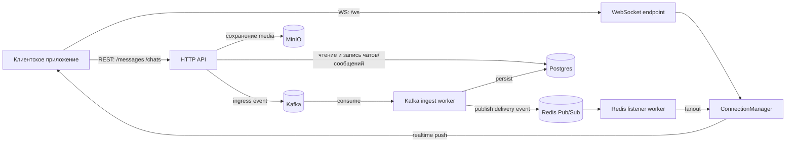

# gadchat

`gadchat` — изолированный backend-сервис чата на `FastAPI` с `WebSocket`-доставкой, рассчитанный на интеграцию в разные продукты как blackbox-компонент.

## Какую задачу решает
- Отправка и хранение сообщений в чатах (включая вложения).
- Realtime-доставка сообщений онлайн-пользователям.
- Пагинация длинной истории чата (cursor-based).
- Горизонтальное масштабирование через shared event-слой (`Redis Pub/Sub`).
- Асинхронный ingest-пайплайн под нагрузку (`Kafka` + отдельный worker).

## Технологии
- `FastAPI` + `uvicorn[standard]`
- `PostgreSQL` + `SQLAlchemy` + `Alembic`
- `Redis` (pub/sub + cache APIs)
- `Kafka` (`faststream` + `aiokafka`) для ingress-потока
- `MinIO` для media-файлов

## Архитектура
- `src/bootstrap`
  - `server.py` — API-процесс (HTTP + WS + background workers)
  - `worker.py` — Kafka consumer-процесс
- `src/entrypoints`
  - `http` — REST endpoints
  - `websockets` — WS endpoint `/ws`
  - `workers` — фоновые задачи API-процесса (например, Redis listener)
- `src/application` — usecases и доменные utils
- `src/infrastructure` — БД, брокеры, storage-клиенты, CRUD/ORM



## Основные endpoint-ы MVP
- `GET /` — demo HTML
- `GET /health` — healthcheck
- `POST /ws-ticket` — выдача ticket для WS
- `GET /chats` — список чатов пользователя
- `GET /chats/{chat_id}/messages` — история с cursor-пагинацией
- `POST /messages` — отправка сообщения
- `WS /ws?ticket=...` — realtime канал

Все публичные ручки ожидают `x-user-id` в headers (MVP-режим).

## Запуск
1. Установить зависимости:
```bash
pip install -r requirements.txt
```

2. Заполнить `.env` (см. `.env.example`):
- `POSTGRES=true`, `POSTGRES_HOST=...`
- `REDIS=true`, `REDIS_HOST=...`
- `KAFKA=true`, `KAFKA_HOST=...`, `KAFKA_TOPIC_INGRESS=...`
- `MINIO=true`, `MINIO_HOST=...` (+ credentials)

3. Применить миграции:
```bash
alembic upgrade head
```

4. Запустить API:
```bash
python -m src.bootstrap.server
```

5. Запустить ingest worker (отдельным процессом):
```bash
python -m src.bootstrap.worker
```
